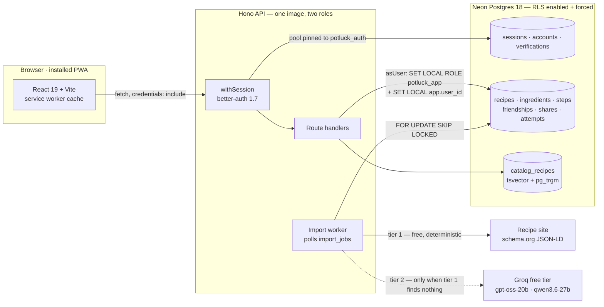
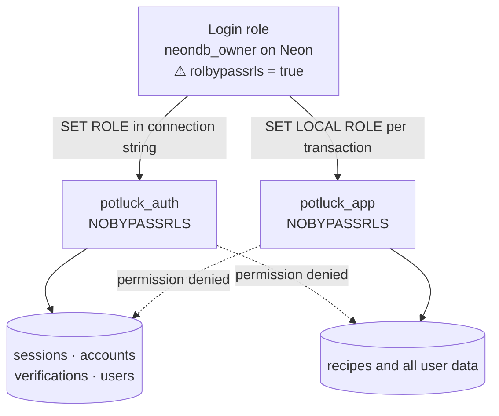
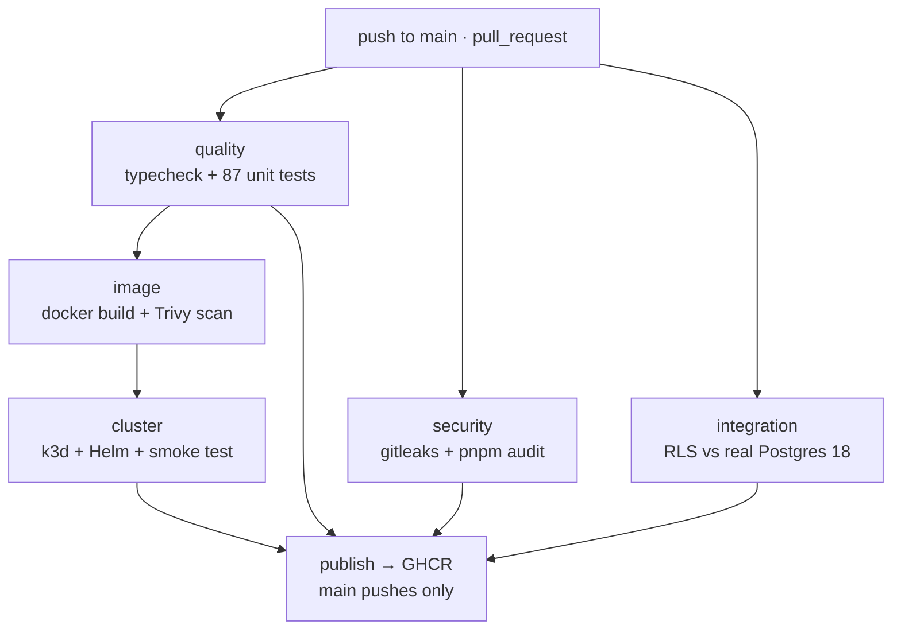

# Potluck

A recipe keeper with friend-group sharing — store recipes, import them from a link, a photo or pasted text, cook from a hands-free Cook Mode, merge a shopping list across recipes, and share with friends who can reply with an "I made this" photo.

[](https://github.com/sahildayal/potluck/actions/workflows/ci.yml)

**Live:** [app](https://potluck-web.onrender.com) · [API](https://potluck-api-pcct.onrender.com/health)

> Both run on Render's free tier, which sleeps a service after 15 minutes idle. The first load after a quiet period takes 30–60 seconds while the container wakes. That is the trade, and it is a deliberate one — see [The $0 constraint](#-the-0-constraint).

**Stack:** TypeScript end to end · pnpm workspace · Hono + Drizzle + Neon Postgres 18 · React 19 + Vite + Tailwind v4 (installable PWA) · Docker + Helm + GitHub Actions

---

## The short version

Three things in this repo are worth a reviewer's time:

1. **Authorization lives in Postgres, not in the request handlers.** Row-level security is `ENABLED` *and* `FORCED` on every table, the app connects as a role that is `NOBYPASSRLS`, and the integration tests are written the way a *careless* handler would write them — no owner filter in any query — asserting that zero rows come back anyway. [Jump to the security model →](#-security-model)
2. **Every architectural decision was made under one hard constraint: $0/month, and no credit card on any service, ever.** Not "free tier with a card on file" — no card. That constraint is why photos are `bytea` columns, why Kubernetes runs in CI rather than on a server, and why authorization is RLS instead of a hosted service. [Jump to the decision table →](#-the-0-constraint)
3. **Kubernetes is proven per pull request.** Every PR spins up a real k3d cluster, installs the Helm chart, runs the migration hook, and smoke-tests the running release before tearing it down. The chart is not "valid YAML" — it is YAML that demonstrably deploys a working system. [Jump to CI/CD →](#-cicd)

---

## 🍲 What it does

| | |
|---|---|
| **Keep recipes** | Title, servings, ingredients, steps, notes, rating, favourites, plus heirloom fields (`attributed_to`, `story`, `year_learned`) for family recipes. Fork any recipe you can see into your own copy. |
| **Import** | From a URL, a photo/screenshot, or pasted text. Queued as a job; every path produces a *draft* a human confirms, never a silent write. |
| **Cook Mode** | One step at a time, screen wake-lock held, with a one-tap timer auto-detected from the step text ("simmer 15 minutes" → a 900-second timer). |
| **Shopping list** | Add a whole recipe; quantities merge across recipes because they are stored canonically. Unparseable lines ("a pinch of saffron") stay as their own line in the original wording. |
| **Public catalog** | A browsable catalog with Postgres-native search — full-text with weighted ranking, plus trigram matching so `chiken` finds chicken. Filter by cuisine, meal, protein; save any entry into your own collection. |
| **Friends & sharing** | Add by exact handle, request/accept, share a recipe with a friend, revoke it later. Sharing grants reading, never writing. |
| **"I made this"** | Anyone who can see a recipe can post an attempt against it. The cook owns their caption; the recipe owner can hide an attempt from their page but cannot rewrite it. |
| **PWA** | Installable, dark mode, offline-tolerant — the shell is precached and recipe reads are stale-while-revalidate, so an offline cook still sees what they saw that morning. |

---

## 🏗 Architecture

A pnpm workspace with three packages and one container image. The API and the import worker are the *same* image in different roles: on Kubernetes they are separate deployments; on Render, where the free tier buys exactly one always-on service, the worker runs in-process via `WORKER_INLINE=true`.



**Request path in one sentence:** the browser sends an httpOnly session cookie, `withSession` resolves it through a database pool pinned to the `potluck_auth` role, and every handler that touches user data does so inside `asUser()` — a transaction that assumes the `potluck_app` role and stamps the caller's id onto the transaction, so Postgres itself filters the rows.

<details>
<summary><strong>HTTP surface</strong></summary>

| Path | Notes |
|---|---|
| `GET /health` | Liveness. Deliberately does *not* touch the database — restarting the API because Neon briefly suspended would turn a blip into a crash loop. |
| `GET /ready` | Readiness. This one *does* check the database, so a pod that cannot reach Postgres is pulled from the Service. |
| `/api/auth/*` | better-auth, registered before the session middleware since it is what creates sessions. |
| `GET /api/me` | Current user or `null`. |
| `/api/recipes` | CRUD, favourite, rating, fork. |
| `/api/categories` | CRUD + reorder. |
| `/api/photos` | Serves bytes straight from `bytea` with `Cache-Control: private, immutable`. |
| `/api/shopping` | List, add from recipe (merging), check, clear checked. |
| `/api/catalog` | Facets, search/browse, detail by slug, save-to-collection. |
| `/api/imports` | Queue a job, poll it, confirm the draft into a real recipe. |
| `/api/social` | Handle lookup, friend requests, shares, attempts, hides. |

Every data route sits behind `requireUser`. `withSession` deliberately does not reject anonymous callers — requiring a user is a separate, explicit decision, so a route is never accidentally public because a middleware was forgotten.

</details>

---

## 💸 The $0 constraint

The rule was: **this costs nothing to run, and no service holds a credit card.** That is stricter than "use free tiers" — several generous free tiers (Cloudflare R2 among them) still require a card on file, which disqualifies them here. Nearly every decision below falls out of that one rule.

| Need | Chosen | Rejected | Why |
|---|---|---|---|
| **Photo storage** | `bytea` columns in Postgres | Cloudflare R2 / S3 | R2 wants a card on file even inside its free allowance. The client downscales to 1200px WebP first, so a photo is 80–150 KB. `bytes` is confined to two tables precisely so swapping in object storage later means implementing one interface, not migrating the schema. |
| **Database** | Neon free tier | Azure Database for PostgreSQL (free 12 months) | Azure's is free *for a year* — that creates a second expiry cliff on top of the credit's. Neon's free tier does not expire, so there is one fewer date to be surprised by. |
| **Authorization** | Postgres RLS + two database roles | A hosted IAM / authorization service | Every such service is paid or card-gated above a trivial tier. RLS is stronger anyway: it is enforced below the application, so a bug in a handler cannot leak data. |
| **Kubernetes** | Ephemeral k3d cluster per CI run | Always-on managed cluster | Public repos get unlimited GitHub Actions minutes, so a real cluster per PR is free. AKS's control plane is free but its node pool costs roughly $30/month. Bonus: the charts are publicly readable *and* provably working. |
| **Job queue** | `import_jobs` table + `FOR UPDATE SKIP LOCKED` | Redis / a message broker | A second stateful service to run, back up and pay for, to solve what one Postgres lock already solves. `SKIP LOCKED` is also what makes multiple worker replicas safe with no leader election. |
| **LLM** | Groq free tier | Any paid inference API | Card-free. It also moved once mid-project (the vision model available on the account changed), which is why everything goes through one `LlmProvider` interface — the swap touched one file. |
| **Catalog search** | Postgres `tsvector` + GIN, plus `pg_trgm` | Algolia / Meilisearch | A hosted search index is another service and another bill. Postgres does weighted full-text *and* typo tolerance in the same query. |
| **Ingress (k3s path)** | Cloudflare Tunnel, no public IP | Static IP + load balancer | Azure charges per static IP, and an exposed SSH port is the most attacked thing on the internet. The node dials *out*; nothing on the internet can reach it. |
| **Email verification** | None — signup is designed to be invite-gated instead | A transactional email provider | No card-free mail provider. `requireEmailVerification: false` is set explicitly, with the reasoning in `auth.ts`. |
| **Live hosting** | Render free tier, two services | A VM that never sleeps | 750 instance-hours a month is roughly one always-on service — which is exactly why `WORKER_INLINE=true` there and the Helm chart splits the worker out properly. |

**Honest caveat:** free-tier terms drift. The specifics above (Neon's storage allowance, Render's 750 hours, Azure for Students' credit) were true when the decisions were made and are recorded in the code comments with dates where they mattered. The *reasoning* is the durable part; the numbers are not.

---

## 🔒 Security model

Authorization is not implemented in the API. It is implemented in `apps/api/src/db/rls.sql`, evaluated by Postgres, and the API layer is treated as untrusted with respect to it.

### The two-role split



| | `potluck_app` | `potluck_auth` |
|---|---|---|
| Reaches | All user-facing data, filtered by RLS policies | `sessions`, `accounts`, `verifications`, `users` only |
| Cannot reach | `sessions`, `accounts`, `verifications` (`REVOKE ALL`), `invite_codes` | Recipes and every other user table |
| Bypasses RLS | No (`NOBYPASSRLS`) | No (`NOBYPASSRLS`) |
| How identity is set | `SET LOCAL ROLE potluck_app` + `SET LOCAL app.user_id`, per transaction | Role pinned for the whole connection via the connection string |

The consequence worth stating plainly: **a fully compromised request handler structurally cannot read a password hash or steal a session token**, because the role it runs as has no privilege on those tables at all. That is asserted, not assumed — see the `credential isolation` tests.

### How identity travels

`asUser(userId, fn)` in `apps/api/src/db/client.ts` is the *only* supported way to touch user data. It opens a transaction, assumes `potluck_app`, sets `app.user_id` via parameterised `set_config(..., true)`, and hands back a scoped client. There is deliberately no exported "just run this query" escape hatch — the absence of one is what makes the guarantee hold. `SET LOCAL` means the setting dies with the transaction, so a pooled connection cannot leak one user's identity into the next request.

A connection that forgets to set an identity sees **zero rows**, not every row. The failure direction is the whole design.

### The war story: `neondb_owner` has `rolbypassrls = true`

This is the bug that would have quietly undone everything. On Neon, the login role the platform gives you can bypass row-level security. Connect as it, run a query, and **every policy is skipped — with no error, no warning, and correct-looking results.** The same is true of the superuser inside the Postgres test container.

Two defences exist because of it:

- **`assertRlsEnforced()`** runs before the server accepts a single request. It assumes `potluck_app` and checks `rolsuper OR rolbypassrls` on the effective role; if the answer is yes, the process refuses to boot with an explanatory error. A misconfigured `DATABASE_URL` fails loudly at startup instead of silently serving everyone's data.
- **A test that asserts the failure mode itself.** In `rls.integration.test.ts`, the `production parity` block proves the login role *does* leak everything when the role is not switched, and blocks correctly the moment it is. It exists so nobody later "simplifies" the `SET LOCAL ROLE` away and disables the entire model.

There is also a grant that is easy to miss: on Neon, `CREATE ROLE` by the owner does not confer membership, so without an explicit `GRANT potluck_app TO CURRENT_USER` every `SET LOCAL ROLE` fails — and the app runs as the bypassing owner. `rls.sql` grants it explicitly.

### Where RLS is deliberately relaxed

RLS being strict creates one genuine problem: the `users` policy hides anyone you have no relationship with, which also hides **the exact person you are trying to add as a friend**. The fix is a narrow `SECURITY DEFINER` function, shaped so it cannot be used to enumerate:

```sql
find_user_by_handle(p_handle text)  -- exact match only, LIMIT 1, no prefix search
redeem_invite(p_code text, p_user uuid)  -- returns only whether it worked
```

Both are `REVOKE ALL ... FROM PUBLIC` and granted only to `potluck_app`. You can find someone whose handle you already know; you cannot list anyone.

### What the tests prove

The RLS integration tests (32 assertions against a real Postgres 18 container) are written *without an owner filter in any query* — deliberately, the way a buggy handler would write them:

```js
// Note the query: no owner filter. A buggy handler would leak here.
const rows = await as(bob, (tx) => tx`SELECT id, title FROM recipes`);
expect(rows).toHaveLength(0);
```

They cover: direct fetch by primary key (the real attack, since ids leak), child rows read around the parent, forging an `owner_id`, sharing that grants reading but never writing, revocation, third parties seeing nothing, the recipe owner being unable to rewrite a cook's caption, and credential isolation in both directions.

Two of them are **guard tests** rather than behaviour tests, and they are what keeps this from rotting:

- every table in `public` must have RLS both enabled *and* forced — a new table without it fails the build;
- every RLS-enabled table must have at least one policy — a table with RLS on and no policy denies everything, which is a different but equally real bug.

---

## 🚀 Getting started

### Prerequisites

| | |
|---|---|
| Node | **>= 22** (`engines` in `package.json`; the image is `node:22-alpine`) |
| pnpm | **11.20.0** (pinned via `packageManager`) |
| Postgres | Any Postgres 18 you can reach — a free Neon project is the intended path |
| Docker | Only for the RLS integration tests (Testcontainers) and for building the image |

### Install and configure

```bash
git clone https://github.com/sahildayal/potluck.git
cd potluck
pnpm install
```

Create a `.env` in the repo root — `scripts/dev.sh` sources it, and `.gitignore` already excludes it. There is no committed template; the authoritative list is the zod schema in `apps/api/src/env.ts`, which validates once at startup and refuses to boot on a bad value rather than surfacing it three requests into production.

<details>
<summary><strong>Environment variables (full list)</strong></summary>

**API** — validated by `apps/api/src/env.ts`:

| Name | Required | Default | Purpose |
|---|---|---|---|
| `DATABASE_URL` | ✅ | — | Postgres connection URL. Must be a role that **cannot** bypass RLS once `potluck_app` is assumed, or the server refuses to start. |
| `AUTH_SECRET` | ✅ | — | better-auth signing secret, minimum 16 characters. |
| `APP_URL` | — | `http://localhost:5173` | The web origin. Doubles as the CORS allowlist and better-auth's `trustedOrigins`, so it must be exact — a wildcard is rejected by browsers once credentials are involved. |
| `API_PORT` | — | `8787` | |
| `GROQ_API_KEY` | — | unset | Optional. Without it, tier-1 (JSON-LD) imports still work; LLM extraction returns "not configured". |
| `NODE_ENV` | — | `development` | `development` \| `test` \| `production`. Also selects the cookie policy: `SameSite=Lax` in dev, `SameSite=None; Secure` in production (the web app is cross-origin there). |
| `WORKER_INLINE` | — | `true` | Runs the import queue in-process. `true` on Render; `false` on k3s, where the worker is its own deployment. |

**Web** (Vite, build-time):

| Name | Purpose |
|---|---|
| `VITE_API_URL` | Absolute API origin in production. Left empty in dev, where the Vite proxy makes `/api` same-origin so the session cookie behaves exactly as it will behind Cloudflare. |

**Deployment only:** the Helm chart reads `secrets.databaseUrl`, `secrets.authSecret`, `secrets.groqApiKey`; Terraform reads `subscription_id`, `ssh_public_key`, `cloudflare_tunnel_token` (see `infra/terraform.tfvars.example`).

</details>

### Migrate and run

```bash
pnpm db:migrate       # drizzle migrations, then rls.sql, then search.sql — in that order
pnpm dev              # both apps in parallel
# or:
bash scripts/dev.sh   # kills stale listeners first, then waits for both to answer
```

Order matters in `db:migrate`: `rls.sql` names every table, so it can only run after they exist; `search.sql` runs last because `rls.sql` drops every policy in the schema before recreating its own, which would otherwise take the catalog's read policy with it. All three steps are idempotent and re-run on every deploy — that is what stops a newly added table from shipping without a policy.

`scripts/dev.sh` exists for an unglamorous reason worth knowing: a stale listener does not stop the *old* server, it stops the *new* one. The API dies with `EADDRINUSE` while the old build keeps serving, and Vite is worse — it silently moves to the next free port and the browser goes on showing the previous build. Both look exactly like "my change did nothing."

---

## 📁 Project layout

```
potluck/
├── apps/
│   ├── api/
│   │   ├── drizzle/                 # generated SQL migrations + snapshots
│   │   ├── scripts/seed-catalog.ts  # fills the public catalog; resumable, dedups by slug
│   │   └── src/
│   │       ├── db/
│   │       │   ├── client.ts        # asUser / asAuthService / asSystem, assertRlsEnforced
│   │       │   ├── rls.sql          # ⭐ the security spine — roles, policies, definer fns
│   │       │   ├── search.sql       # generated tsvector + GIN + pg_trgm indexes
│   │       │   ├── schema.ts        # Drizzle schema; every user table carries owner_id
│   │       │   ├── migrate.ts       # migrations → rls.sql → search.sql
│   │       │   └── rls.integration.test.ts   # ⭐ the proof, against real Postgres
│   │       ├── import/
│   │       │   ├── jsonld.ts        # tier 1: schema.org Recipe, free and exact
│   │       │   ├── llm.ts           # tier 2: the LlmProvider seam + Groq impl
│   │       │   ├── extract-json.ts  # un-wraps <think> blocks, fences, truncated JSON
│   │       │   └── process.ts       # tier selection, walled-garden rejection
│   │       ├── routes/              # recipes · categories · photos · shopping
│   │       │                        # catalog · imports · social
│   │       ├── middleware/session.ts
│   │       ├── auth.ts              # better-auth, pinned to the potluck_auth role
│   │       ├── env.ts               # zod-validated env, authoritative
│   │       ├── app.ts · server.ts   # Hono app, graceful drain on SIGTERM
│   │       └── worker.ts            # import queue: SKIP LOCKED, paced to the free tier
│   └── web/
│       └── src/
│           ├── screens/             # Home · Browse · CookMode · Import · Friends
│           │                        # Shopping · RecipeDetail · RecipeEditor · You
│           ├── components/ · lib/   # api client, theme
│           └── styles/app.css       # "Pantry Pastel" — semantic colour, inverted for dark
├── packages/core/src/
│   ├── units.ts                     # canonical quantities; refuses to guess
│   ├── duration.ts                  # timer detection from step text
│   └── types.ts                     # zod schemas shared by both apps
├── charts/potluck/                  # Helm: api, worker, tunnel, migrate hook, secret
├── infra/                           # Terraform: Azure B1s + k3s, no public IP
├── scripts/                         # dev.sh, smoke.mjs, verify-features.mjs
├── .github/workflows/ci.yml
├── Dockerfile                       # multi-stage; runtime carries no toolchain or source
└── render.yaml                      # the live deployment
```

---

## 🧪 Testing

Four layers, each proving something the layer below cannot.

| Layer | Count | What it proves | Command |
|---|---|---|---|
| **Unit — `@potluck/core`** | 38 | Unit canonicalisation, scaling and formatting; duration detection from step text | `pnpm --filter @potluck/core test` |
| **Unit — `@potluck/api`** | 38 | JSON-LD parsing against the shapes real recipe sites emit (24); recovering JSON from model replies (14) | `pnpm --filter @potluck/api test` |
| **Unit — `@potluck/web`** | 11 | Ingredient/step text parsing in the editor; deterministic doodle selection | `pnpm --filter @potluck/web test` |
| **RLS integration** | 32 | That authorization holds *even when the API forgets to filter*, against a real Postgres 18 container | `pnpm test:integration` |
| **Smoke** | 13 checks | Signup, recipe round-trip with quantities parsed, and a stranger still refused — end to end against a running deployment | `node scripts/smoke.mjs <base> [origin]` |
| **Feature verification** | 26 checks | Three accounts driven through friending, sharing, imports and attempts — asserting the *negatives* | `node scripts/verify-features.mjs [base] [origin]` |

```bash
pnpm -r test            # 87 unit tests, no database or Docker needed
pnpm test:integration   # needs Docker; starts a throwaway Postgres 18
pnpm -r typecheck
```

**Why the last two exist.** `smoke.mjs` is small on purpose — it exercises the paths that would be catastrophic to ship broken, not every branch, and it is the same script CI runs inside the k3d cluster. `verify-features.mjs` is where the sharing model is actually pinned down, because these features are mostly about what one account *cannot* see of another's, which no single-user test can catch. Its assertions are mostly negative: a friend cannot see an unshared recipe, sharing never grants edit rights, a third party sees nothing, you cannot share a recipe you do not own, a requester cannot accept their own friend request, someone without access cannot post an attempt.

Both scripts send an `Origin` header on every request, because better-auth checks it against `trustedOrigins` — a request without one is rejected with 403, exactly as a browser-less attacker's would be.

The API unit config tags its unit tests so `vitest run` never picks up the integration suite by accident; the integration suite has its own config (`vitest.integration.config.ts`).

---

## ⚙️ CI/CD

`.github/workflows/ci.yml` — six jobs, on every push to `main` and every pull request.



| Job | What it does |
|---|---|
| `quality` | `pnpm -r typecheck` and `pnpm -r test`. |
| `security` | gitleaks over full history (hence `fetch-depth: 0`), then `pnpm audit --audit-level high`. |
| `integration` | The RLS suite against a Testcontainers Postgres 18 — the same major version Neon runs. |
| `image` | Builds the multi-stage image with GHA layer cache, exports it as a tarball, scans it with Trivy for HIGH/CRITICAL. |
| `cluster` | **The interesting one.** See below. |
| `publish` | Pushes `:latest` and `:<sha>` to GHCR. Gated on all four other jobs, and only on a `main` push. |

### The ephemeral-Kubernetes job

A merge is blocked unless the Helm charts actually deploy a working system into a real cluster — not merely render valid YAML. Per run, the job:

1. installs k3d and creates a single-node cluster (Traefik disabled — the chart uses a Cloudflare Tunnel, not an Ingress);
2. imports the image built by the previous job, so nothing is pulled from a registry;
3. starts Postgres **in-cluster** rather than branching Neon — deliberately, so the pipeline needs no credentials and a fork's pull request can run it too;
4. `helm lint`, then `helm install --wait`, which fires the `pre-install` migration hook that applies the schema *and* `rls.sql` — so a PR that adds a table without a policy fails here rather than shipping unprotected;
5. port-forwards the Service and runs `scripts/smoke.mjs` against it;
6. on failure, dumps events, pod descriptions and logs from all three components;
7. deletes the cluster in an `if: always()` step.

This is what "unlimited Actions minutes on a public repo" buys: a genuinely disposable production-shaped environment, per PR, for free.

**Two deliberately non-blocking gates,** stated because a reviewer will notice: `pnpm audit` and Trivy report rather than fail. A transitive low-severity advisory with no patch available should not stop a recipe app from shipping, and base-image CVEs are fixed by rebuilding on a newer `node:22-alpine` — a hard gate there blocks unrelated work on someone else's schedule. The reasoning is written into the workflow at both sites.

<details>
<summary><strong>Container notes worth reading if you build images</strong></summary>

- Multi-stage: the runtime carries no toolchain, no source and no dev dependencies.
- Typechecks during the build — an image that compiles is the minimum bar for one that ships, and catching it there beats catching it in a `CrashLoopBackOff`.
- `NODE_OPTIONS=--max-old-space-size=192`, because Node sizes its heap from the *host's* memory rather than the cgroup's, grows past the pod limit, and gets OOM-killed by the kernel — which surfaces as a mysterious restart, not an OOM.
- `dumb-init` as PID 1 so `SIGTERM` reaches Node and the graceful drain in `server.ts` actually runs during a rolling deploy.
- Migrations and the security SQL ship *inside* the image, so a deploy and its schema can never disagree about which version they are.
- `@potluck/core` points at TypeScript source for dev tooling; the runtime stage rewrites its entry points to the compiled output rather than committing a dist-shaped `package.json`.

</details>

---

## 📦 Deployment

### Render (live)

`render.yaml` is a two-service blueprint, both free, both card-free: `potluck-api` from the repo's Dockerfile with `healthCheckPath: /health`, and `potluck-web` as a static site with an SPA rewrite and a `no-store` header on `sw.js` (or an installed PWA can pin itself to an old build forever). `AUTH_SECRET` is generated by Render; `DATABASE_URL`, `GROQ_API_KEY` and `APP_URL` are `sync: false` so no credential lives in the repo.

Because the free tier's 750 instance-hours cover roughly one always-on service, `WORKER_INLINE=true` there — the import queue runs inside the API process. Same image, different topology.

### Kubernetes + Terraform (written, **not applied**)

The `infra/` Terraform describes one Azure B1s running single-node k3s with **no public IP, no load balancer and no inbound security rule** — the node dials out to Cloudflare and all traffic, including SSH, arrives down that tunnel. There is an explicit deny-all inbound NSG rule, present mostly so a future "just open 22 for a minute" cannot be quiet.

**This has not been applied.** No Azure resources have been created from it. It is committed because the design is the point — and because the same Helm chart it targets is exercised for real in CI on every PR, which is a stronger claim than a `terraform plan` would be.

The chart (`charts/potluck`) differs from Render in the ways a real cluster allows: the worker is its own deployment, migrations run as a `pre-upgrade` hook (a failed migration aborts the release and the previous version keeps serving), resources are sized so both pods plus k3s fit in 1 GB, containers run as non-root with `readOnlyRootFilesystem` and all capabilities dropped, and secrets are created out of band so no credential passes through a values file.

---

## 🧭 A few engineering details

**Canonical units are what make the shopping list work.** A recipe stores `473 ml`, and displays "2 cups" or "1 tsp" depending on the user's preference. That is what lets 2 tbsp of oil from one recipe and 3 tbsp from another merge into a single line — merging is by item name *and* canonical unit. The module refuses to guess: "a pinch of saffron" and "2 medium onions" store `null` and keep the source's exact wording in `raw_text`, because a confidently wrong conversion is worse than none. Parsing never overwrites the original line.

**Import is tiered, cheapest first.** Tier 1 reads schema.org `Recipe` JSON-LD straight off the page — exact, instant, and zero AI tokens, which covers the large majority of recipe sites because Google requires the markup for rich results. Only pages where that comes back empty reach the model. `extract-json.ts` then deals with what models actually return: `<think>` reasoning blocks, ```json fences, unasked-for preambles, and replies truncated mid-object by a token limit — it scans for a balanced JSON span rather than regexing for one, because braces nest and appear inside strings. No path writes a recipe directly; every one produces a draft a human confirms, which is what makes an imperfect extractor acceptable.

**Catalog search is Postgres-native, and the operator matters.** A generated `tsvector` column with weighted `setweight` (title > tags > summary > ingredients) sits behind a GIN index, queried with `websearch_to_tsquery` — which understands quotes and `OR` the way people type, and unlike `to_tsquery` never throws on odd input. Typo tolerance comes from `pg_trgm` with the **word**-similarity operator `<%`, not `%`: a short typo against a long title scores far below threshold as whole strings, so `%` silently matched nothing. The threshold is lowered to 0.42 via `SET LOCAL`, because "chiken" scores about 0.57 against "chicken" — just under the 0.6 default, meaning the single most likely typo in a recipe app found nothing at all.

**Cook Mode timers are deliberately conservative.** A missed timer costs nothing; a wrong one ruins dinner. So the detector only matches a number sitting against a time unit, takes the *lower* bound of a range ("5 to 10 minutes" → 5, because firing early prompts you to check), folds "1 hour 30 minutes" into one duration, and rejects anything over 24 hours.

**One read, two batched writes.** Adding a seven-ingredient recipe to the shopping list the obvious way — query, then insert-or-update, per ingredient — measured five seconds against Neon, which is unusable while standing in a kitchen. Reading the list once, merging in memory and writing in batches takes three.

---

## ⚠️ Known limitations & roadmap

Stated plainly, because a README that claims everything works is not worth reading.

- **Cold starts.** Render's free tier sleeps after 15 minutes idle; the first request then takes 30–60 seconds. Neon also auto-suspends. This is the cost of the $0 constraint and is not going away on this hosting.
- **Signup is open.** The invite machinery is real — the `invite_codes` table, a unique index on `redeemed_by` that makes a double redemption impossible, the `redeem_invite` SECURITY DEFINER function and its tests all exist and pass — but nothing in the signup path enforces it yet and there is no UI to issue a code. The comment in `auth.ts` describing signup as invite-gated is aspirational as of now; treat the deployed app as open registration.
- **The catalog is still being filled.** `catalog:seed` takes a target (default 1,000) and is resumable — it loads existing slugs and fills gaps rather than duplicating — but it is paced by Groq's free-tier token budget, so it grows in passes rather than one run.
- **Catalog nutrition is an estimate.** `protein_grams` and `calories` are model-generated, not measured, and the UI says "about" for that reason. Good enough to sort and filter by; not good enough to build a diet on.
- **Terraform is unapplied.** See above.
- **Walled gardens are refused, not scraped.** Instagram, TikTok, Facebook and Pinterest URLs are rejected up front rather than failing slowly.
- **Import throughput is capped by the free tier.** Groq allows roughly 6,000 tokens/minute and a photo import costs about 2,200, so the ceiling is a couple of imports per minute. The worker paces itself rather than collecting 429s.
- **US customary volumes are assumed** when parsing imperial units, since most imported sites are American. A UK "cup" differs and is not detected — which is exactly why `raw_text` is preserved verbatim.

---

## 📄 License

No `LICENSE` file is present in this repository yet — licensing is **TBD**. Until one is added, no license is granted; please ask before reusing.

---

<sub>Built by Sahil Dayal. The comments in this codebase explain <em>why</em>, not <em>what</em> — `rls.sql`, `client.ts`, `units.ts` and `ci.yml` are the ones worth reading if you only read four.</sub>
